```{r setup, include=FALSE}
knitr::opts_chunk$set(echo = FALSE)
```

# Introduction

This is a vignette for the Shiny App of the **SmartPhos** package. The shiny app is a pipeline for *proteomics* and *phosphoproteomics* data where users can upload their data and perform preprocessing, exploratory analysis and some downstream analysis as well. The default view of the shiny app:

```{r}
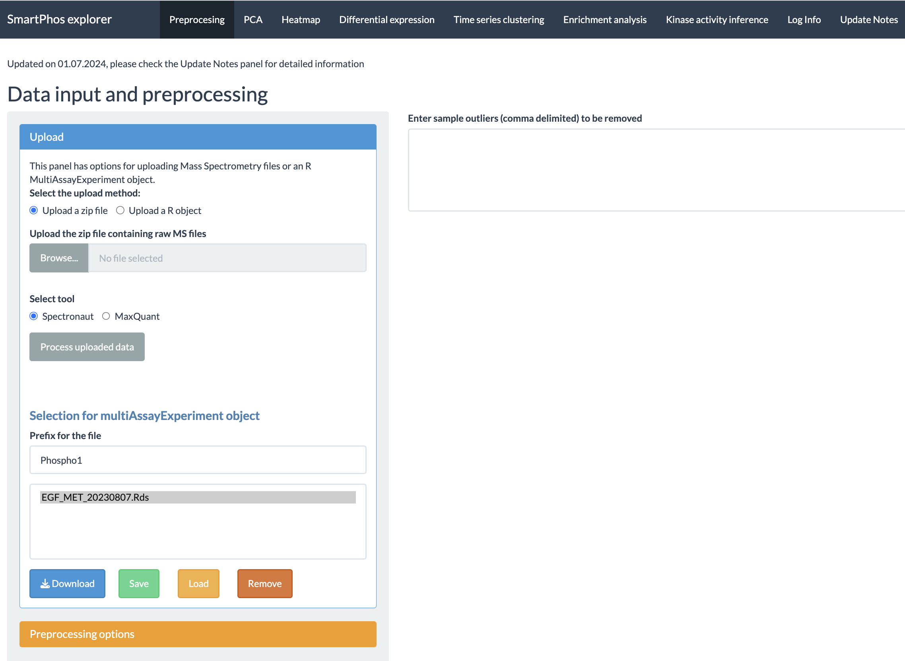
```

The current tabs are:

* Preprocessing
* PCA
* Heatmap
* Differential expression
* Time-series clustering
* Enrichment analysis
* Kinase activity inference
* Log Info
* Update Notes

The vignette will go through the different tabs of the shiny app and explains how each of the functionalities work.

# Preprocessing tab

This tab contains the preprocessing options before diving into the data for exploratory and downstream analysis. This tab allows the user to upload a MultiAssayExperiment object or upload a zip file containing mass spectrometry files. It contains options for selecting between the proteome or phosphoproteome assay. Options for choosing the transformation method, normalization, and displaying the missing values are available. There is also an option for saving the R object in the app.

## Upload options

Uploading is one of the most important steps in the smooth functioning of the app.

```{r, out.width = "350px"}
knitr::include_graphics("images/2.png")
```

As shown in the figure, user has the option to decide between uploading a **zip file** and a **MultiAssayExperiment object**. The zip file contains processed files from *Spectronaut* or *MaxQuant*. When using zip file option, there are certain requirements the user needs to follow for the conversion of the data from these file into a multiAssayExperiment object. The necessary requirement for the zip file is to contain a proper *fileTable.txt* file. The details of this file are explained in the next subsection.

### fileTable.txt file

This text file contains the information about the different quantification files and the other experimental details like treatment types, timepoints, etc. The data is arranged in tab separated columns. SmartPhos package make use of this information to generate a multiAssayExperiment object. Shiny app will display an error message if this file is missing or the format of file is incorrect. The important columns to keep in mind when making this file are as follows:

* **fileName**: Contains the names of the files which has the quantification data. Make sure that it contains only the name of the file and not the relative or absolute path. 
* **id**: Contains sample IDs.
* **type**: Contains information on the type of search performed on the samples by Spectronaut or MaxQuant. There are two possibilities: *proteome* and *phosphoproteome*. The two types are represented as two assays in the multiAssayExperiment object.
* **sampleType**: Contains information for enrichment. If the sample is enriched, the sampleType is *Phospho* and for non-enriched, the sampleType is *FullProteome*.

The above mentioned columns are the most important ones. Other than that, filetable.txt can contain columns like:

* **subjectID** with information like patientID, cell lines, etc. 
* **timepoint** with values like 0min, 20min, 6h, 24h, etc.
* **replicate** with values rep1, rep2, replicate1 and so on.
* **treatment** containing information about different treatments.

Here is an example of the fileTable.txt file: 

```{r, out.width = "600px"}
knitr::include_graphics("images/3.png")
```

**NOTE**: It's better to not have any special characters ('(', ')', '#', '%', '@', etc) in the column names of the mass spec files by Spectronaut/MaxQuant and same for the ID column of the fileTable.txt file. This can sometimes cause error in the reading of the data and creating the proper multiAssayExperiment object.

### Column annotations

User have option to select the column annotations when using the zip file method. If the upload of zip file is successful, another widget will appear which will allow the user to select from the different available annotation options. Multiple selections are possible simply by clicking on the list item. 

```{r, out.width = "350px"}
knitr::include_graphics("images/4.png")
```

### MultiAssayExperiment object

The other option which the user has is to direct upload a multiAssayExperiment object. It's a class S4 R object and is saved as **rds** file. This object can be created using the functions from SmartPhos package. 

### Error checks and other options

If the processing of zip files or multiAssayExperiment object is successful, then the upload tab will show the total number of samples and features.

```{r, out.width = "350px"}
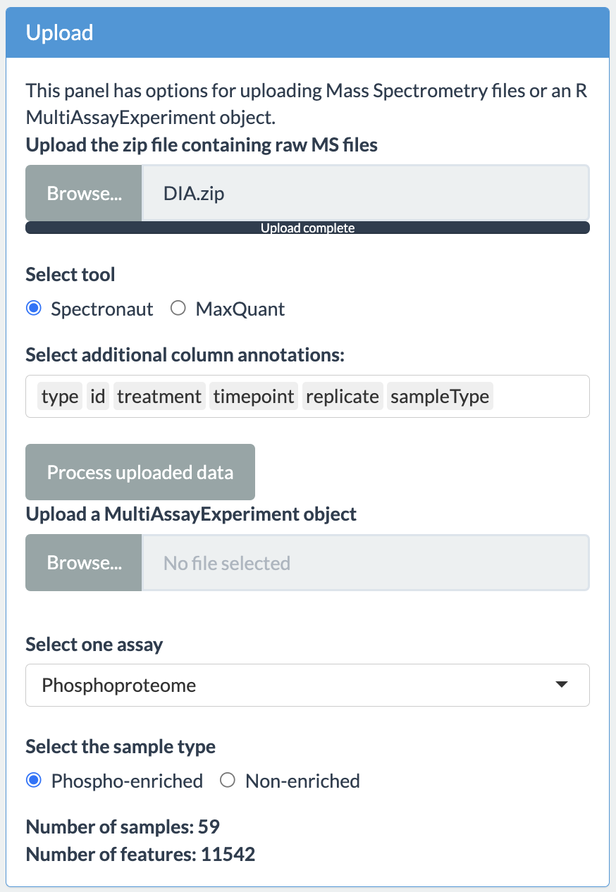
```

The user will have option to choose the assay and sample type as shown in the figure above. In case the upload is not successful, the app will display an error message. These error messages are:

```{r, out.width = "350px"}

```
```{r, out.width = "350px"}
knitr::include_graphics("images/error2.png")
```
```{r, out.width = "350px"}
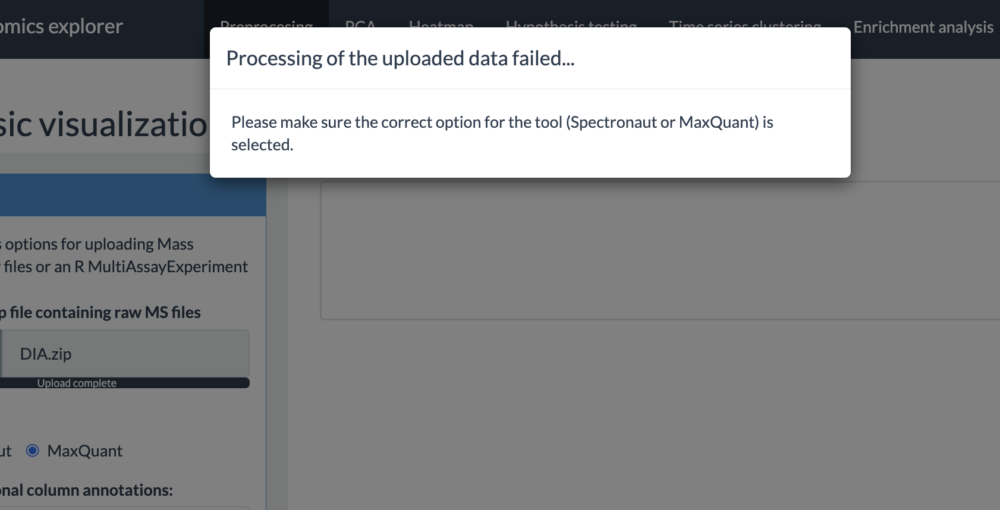
```

## Preprocessing options

SmartPhos package performs some pre-filtering and preprocessing based on various threshold values during the generation of the multiAssayExperiment object. On top of that, this panel has different options for preprocessing of the selected assay. The options provided by the shiny app are as follows:

* **Normalization correction**: This option is present only if the phophoproteomics data is present. It allows for the correction of normalization artefacts introduced by the Spectronaut. 
* **Transformation**: The transformation methods available are: log2 and vst (variance stabilizing transformation).
* **Normalization**: Normalization strategy depends on the selected transformation method. Therefore, the user has option of *Yes* or *No*. If the user selects *Yes*, then for log2 and no transformation, *median scaling* is applied and for vst, *vsn* is applied. 
* **Missing values**: Users can select what percentage of missing values are allowed. Proteins with missing values above the selected threshold will be removed from all analyses.
* **Imputation**: Currently three imputation methods are available: 
  + QRILC (Quantile Regression Imputation of Left-Censored data)
  + BPCA (Bayesian PCA)
  + MLE (Maximum Likelihood Estimation)
  + Random forest
  
After selecting the options, press the **Process** button to perform the preprocessing. 
  
```{r, out.width="350px"}
knitr::include_graphics("images/preprocess.png")
```

## Other options

The preprocessing tab has some more options:

* Plot the completeness of the assay. It will plot a bar plot displaying percentage of completeness for each sample.
* Launching MatrixQCvis. Another shiny app for exploratory analysis.
* Saving, loading and removing results. The multiAssayExperiment object can be saved, loaded and removed within the shiny app.
* Samples which are outliers can be removed. Simply writing the names of the samples (delimited by comma) in the text box will remove those samples.
* Coloring the box plot based on different annotations is also possible. 

```{r, out.width="320px"}
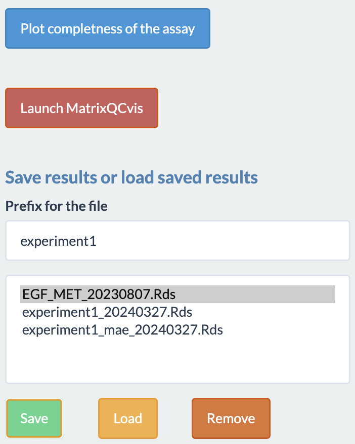
```
```{r, out.width="400px"}
knitr::include_graphics("images/otherOptions2.png")
```

## Output

The different outputs available to the users are:

* A box plot of intensity values for each samples. 
* A diagnostic plot of phopho to fullProteome ratio. This plot can be used to decide if the normalization correction should be performed or not. It can also shows the outliers.
* A data table showing the information about each samples.
* A bar plot which shows the percentage of completness of each samples. 


```{r}
knitr::include_graphics(c("images/boxPlot.png", "images/logRatio.png",
                          "images/table.png", "images/completeness.png"))
```


# PCA

This tab performs principal component analysis (PCA) on the imputed assay from the *Preprocessing* tab and then plot the principal components.

```{r, out.width="300px"}
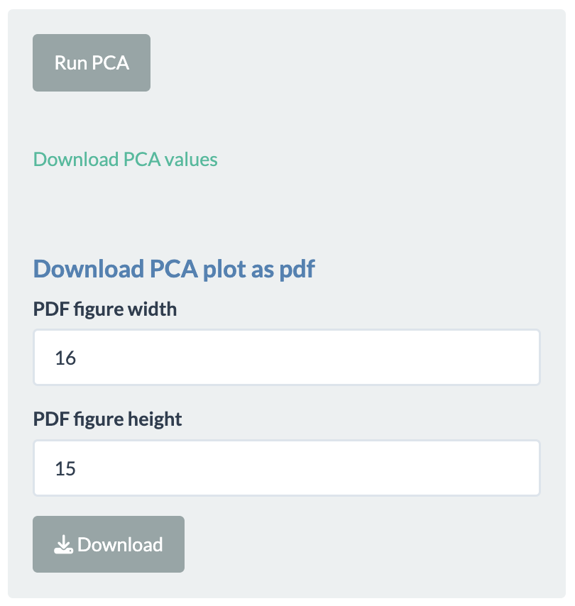
```

Simply click on **Run PCA** button to perform PCA. The different options available to the users after plotting are:

```{r, out.width="300px"}
knitr::include_graphics("images/13.png")
```

* Selecting the principal components for x- and y-axis.
* Two more dimensions can be added to the data points using **color** and **shape** options.
* The plotting is done using **Plotly** package, so users have many functionalities. For example, hovering over the plotted data points will display more information, downloading plot as PNG file, etc.
* PCA values can be downloaded as a tsv file.
* PCA plot can also be downloaded as a pdf file.

```{r, out.width="490px"}
knitr::include_graphics("images/pca1.png")
```
```{r, out.width="600px"}
knitr::include_graphics("images/pca2.png")
```
```{r, out.width="600px"}
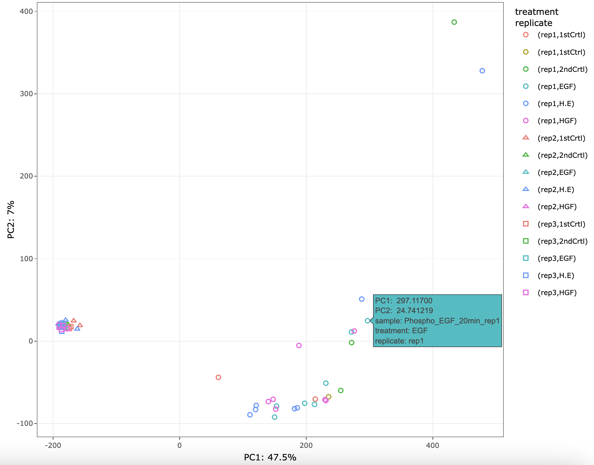
```


NOTE: If imputation is selected *none* in the preprocessing tab, then performing PCA is not possible. An error message will pop-up on screen. 

# Heatmap

This tabs allow the user to plot the heatmap of the imputed assay from the preprocessing tab. Users can select from the three choices available:

```{r, out.width="450px"}
knitr::include_graphics("images/14.png")
```

* **Top variant**: This allows the users to plot the genes with highest variance. Users can decide the number of top variants genes to plot. This option performs clustering automatically. The user also has the option to divide the columns and rows of the heatmap into specific number of clusters. 
* **Differentially expressed**: Allows to plot the heatmaps for differentially expressed genes. The differential expression analysis is available in *hypothesis testing* tab and can be performed using ProDA or Limma. 
* **Selected time series cluster**: After performing the time-series clustering in another tab, users have option to plot the heatmap of the selected cluster.

For all the above-mentioned options, users can add additional column annotations to the plotted heatmap. Adding more column annotations to the heatmap can be helpful to understand the heatmap better and see the patterns in the data more clearly. User can also download the heatmap as a PDF. 

```{r, out.width="300px"}

```

```{r}
knitr::include_graphics(c("images/heatmap1.png", "images/heatmap2.png"))
```

The tab also has error checks. If the user tries to plot the heatmap of differentially expressed genes or the genes from the selected time series cluster prior to performing the aforementioned analysis, an error message will be displayed.

```{r, out.width="400px"}
knitr::include_graphics("images/errorHeatmap.png")
```

# Differential expression

This tab performs differential expression analysis on the transformed and normalized assay from the first tab. The goal of performing differential expression analysis is to quantify the expression levels of genes between different experimental conditions using statistical tests.

If the users want paired t-test on the patient IDs, cell lines, etc, then the users must have **subjectID** as one of the column in the *fileTable.txt* file with the relevant information. The subjectID column should also be selected in the additional column annotations before the generation of multiAssayExperiment object. 

The two methods available for performing differential expression analysis are:

* **limma**: uses linear models.
* **ProDA**: uses probabilistic dropout model.

To use this tab, users need to select samples for the reference and target group, between which the differential expression analysis will be performed. This can be done by either selecting treatments or selecting sample IDs. In the former, time points should also be specified if the column **timepoint** is present in the *fileTable.txt* file. Multiple treatments and time points can be selected for each group. As the selection is updated for each group, the user interface informs users of the number of samples in each group as well as a warning if a sample is present in both group. The latter option allows users to directly choose which sample to include in each group, thereby allowing more flexibility in sample selection. The two figures below show examples of the user interface when using either option. Notice that a warning was given in the latter since one sample was present in both groups.

```{r, out.width="300px"}
knitr::include_graphics("images/Q_DE_option1.PNG")
```

```{r, out.width="300px"}
knitr::include_graphics("images/Q_DE_option2.PNG")
```

The output of differential expression analysis is a table which contains the differentially expressed genes arranged by the lowest p-values. The other information present in the table are: Uniprot ID, log2 fold change, t-statistic, adjusted p-value and some information if the data is phosphoproteomic data. A volcano plot is also plotted, highlighing the points with positive and negative log fold-change and above certain p value. The histogram of p-value is also plotted. 

```{r}
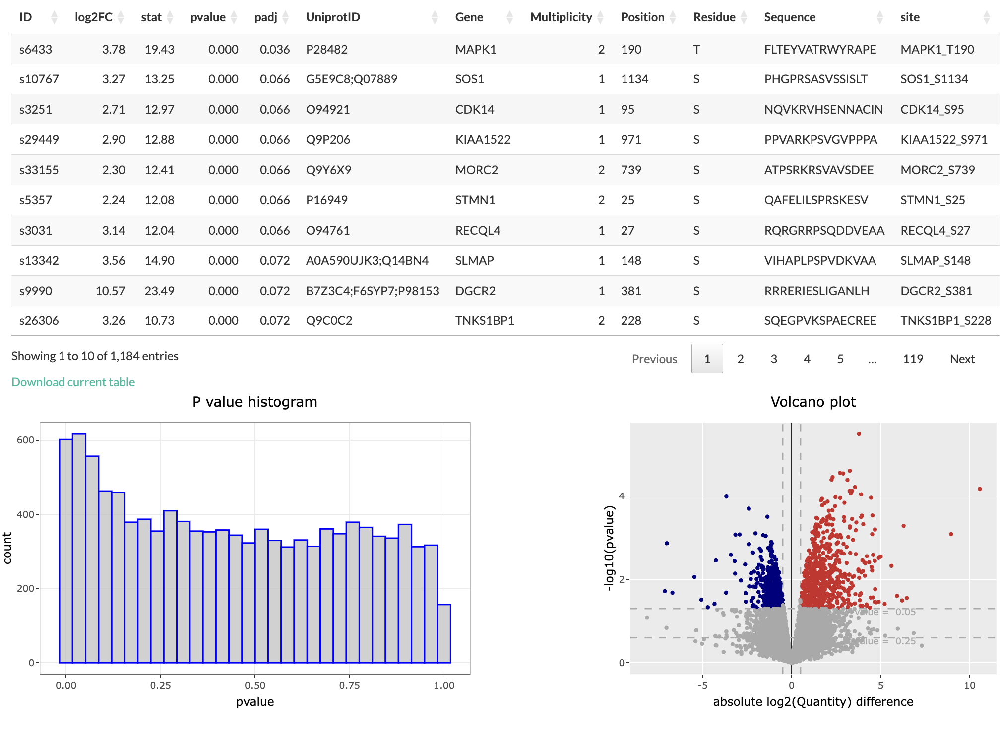
```

Users have options to filter the differentially expressed genes table based on p-value and log fold change value. There is also an option of using adjusted p-value instead.

```{r, out.width="300px"}

```

If the user click on the row of the differential expression table, the corresponding point in the volcano plot is highlighted as star. Moreover, a box plot is plot to show the change in normalized intensities for the selected conditions. Also, if the user click on any coloured point in the volcano plot, the corresponding row in the differential expression table is highlighted. The user also has the option to download the differential expression table as a TSV file.

```{r}
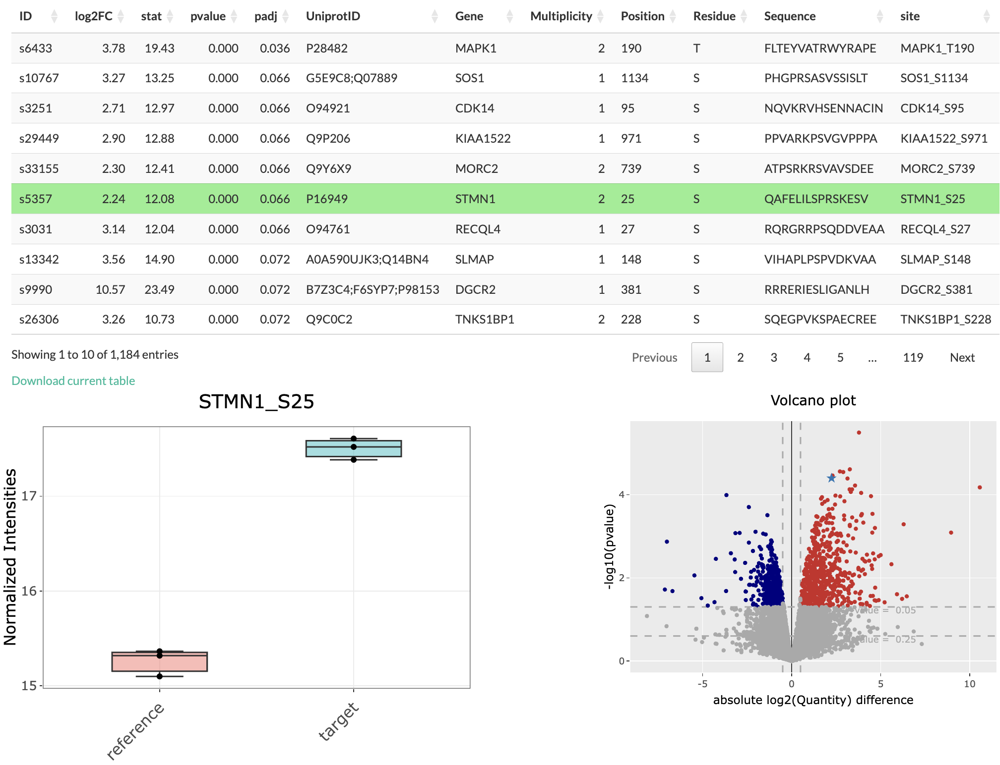
```

In case the differential expression analysis is not possible for the selected settings, an error message will appear. 

```{r, out.width="400px"}
knitr::include_graphics("images/errorDEA.png")
```

# Time series clustering

This tab performs **fuzzy c-means clustering** to group proteins/phosphopeptides based on how their level changed over time. The algorithm considers the time-resolved trend, but not the expression levels. Thus, members of the same cluster would have a similar trend over time (e.g., all increasing or all decreasing), though their expression level can be different.

To use this tab, users must specify the **timepoint** column in the **fileTable.txt** file when preparing the data. The time points are either unit-less numbers (e.g., 1, 2, 3) or are in hour and/or minute, which must be typed as "h" and "min", respectively (e.g., 1min, 2min, 3h). Please notice that mixing the two said options (e.g., 1, 2min, 3) or using other unit for time (e.g., 1hour, 2minute, 3day) will likely lead to wrong results.   

The options for using this tab are as follow:

```{r, out.width="300px"}
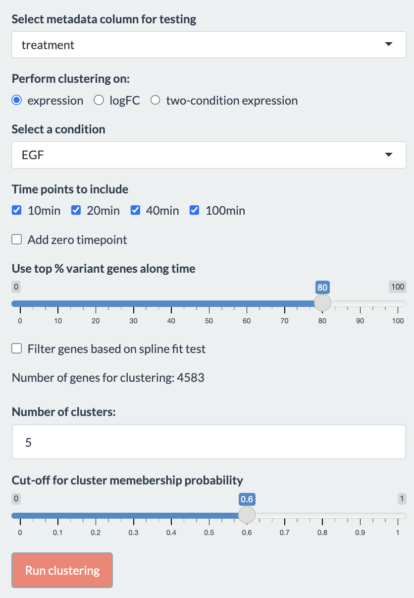
```

Users first need to choose a treatment of interest for the analysis. Additionally, if the clustering is performed on either "logFC" or "two-condition expression", a reference treatment should also be chosen. The options to perform clustering on determine what it means for genes to be in the same cluster:  

* **expression**: Genes in the same cluster have the similar trend in their **expression level**.
* **logFC**: Genes in the same cluster have the similar trend in their fold-change, (**logFC**). The fold-change is the difference in expression level between the two selected treatments.
* **two-condition expression**: Genes in the same cluster have the similar trend in their **expression level** and between the two treatments.

Users can choose to include or exclude certain time points by checking the boxes. The time points are updated when selecting the treatments.

## Other parameters for the analysis
* **Use top % variant genes along time**
* **Filter genes based on spline fit test**: If selected, a spline fitting would be used to filter out genes whose changes are inconsistent. **subjectID** is used to pair samples if provided, otherwise the replicates are considered independent.
* **Number of clusters**: We advise users to try the analysis with multiple values to select the best number of clusters.
* **Cut-off for cluster membership probability**: Genes are removed from a cluster if their probability to be in that cluster is below this cut-off value.

## Output

The plot shows the time-course trend of genes in the clusters. If either **expression** or **logFC** was chosen, the color would indicate the genes' membership probability: 
```{r}
knitr::include_graphics("images/timeSeriesClust1.png")
```

If **two-condition expression** was chosen, the color is used to distinguish the treatments:
```{r}
knitr::include_graphics("images/timeSeriesClust2.png")
```

Accompanying the plot is a table show the details of the genes in each cluster. User can select the cluster to view with the drop-down menu on the upper left side of the table. The table can be downloaded as a tsv file. The selected cluster will be used as input for enrichment analysis and kinase activity inference.
```{r}
knitr::include_graphics("images/Q_time_series_example_result2.PNG")
```

Clicking on a gene will show a plot of its time-course expression level:
```{r}
knitr::include_graphics("images/Q_time_series_example_result3.PNG")
```

If no cluster was found, for instance due to cut-off values being too high, users will be informed with a pop-up window:
```{r}
knitr::include_graphics("images/timeSeriesErr1.png")
```

# Enrichment analysis

This tab performs enrichment analysis on genes or phosphosites that are differentially expressed or in a time series cluster. To use this tab, users would first need to perform either a differential expression analysis or time-series clustering. In the latter, users would also need to select a cluster of interest in the time-series clustering tab. We offer the possibilities to perform enrichment analysis on either gene sets (gene-centric) or post-translational modification signature sets (site-centric). In the latter, each set contains PTM site names with direction of regulation (up- or down-regulated) instead of gene names. Only phosphorylation sites will be considered since this pipeline supports proteomic and phosphoproteomic data. The gene sets and PTM signature sets are derived from the Molecular Signatures Database (Subramanian, Tamayo et al.,2005; Liberzon et al., 2011, Liberzon et al., 2015) and the PTM Signature Database version 2.0.0 (Krug et al., 2019), respectively. Users are encouraged to consult the PTMsigDB website (https://proteomics.broadapps.org/ptmsigdb/) and the paper of Krug et al. for details on how PTM signature sets were curated and their annotation.

In gene-centric pathway enrichment, users can perform either Parametric Analysis of Gene Set Enrichment (PAGE) (Kim & Volsky, 2005) or Gene Set Enrichment Analysis (GSEA) (Subramanian, Tamayo et al.,2005) with Differential Expression analysis result. With Time series clustering result, we offer the Fisher's exact test. For phospho-signature enrichment on Differential Expression analysis result, we offer PTM-Signature Enrichment Analysis (PTM-SEA), a method adapted from GSEA by Krug et al. (2019) to be applicable with the PTM Signature Database. On time series clustering result, we offer the Fisher's exact test, in which each signature set is split into two, one containing upregulated and the other downregulated phosphosites.

Options for performing enrichment analysis are shown below:
```{r, out.width="300px"}
knitr::include_graphics("images/Q_enrich_option1.PNG")
```

* **Select analysis method**: Whether to perform gene-centric pathway enrichment or site-centric phospho-signature enrichment. If the Proteome assay is selected in the preprocessing tab, only the former is available.
* **Source of gene list**: Whether to use result from differential expression analysis or time-series cluster
* **Select enrichment method**: Which method should be used for the analysis. In pathway enrichment, the method is either "PAGE" (Parametric Analysis of Gene Set Enrichment) or "GSEA" (Gene Set Enrichment Analysis) for differential expression result and only Fisher's exact test for time-series clustering. If "GSEA" is chosen, the number of permutations to generate the null distribution should also be specified (default 100). In phospho-signature enrichment, the method is PTM-SEA (not shown on UI) for differential expression and Fisher's exact test for time series clustering.
* **Statistic used for ranking**: Whether to use t-statistics or log2FC for the analysis, only applies to differential expression result.
* **Select geneset database**: Which gene set or PTM signature set database should be used for the analysis. The analysis method chosen above affects the options available here.
* P-value cut-off and option to use FDR.

## Output
If either differential expression analysis or time-series clustering has not been performed (depending on the selected **Source of gene list**), users would be informed of the error:
```{r, out.width="300px"}
knitr::include_graphics("images/Q_enrich_err1.PNG")
```

Otherwise, the result is shown in a table indicating the genesets' names, number of genes in set, enrichment score (PAGE, GSEA, and PTM-SEA), and p-values. In PTM-SEA, each reported enrichment score is normalized by the mean of the null distribution's enrichment score to control for differences in signature set size. Example results are shown in the figures below, along with explanation for each column.

(Pathway enrichment for Differential Expression analysis)
```{r}
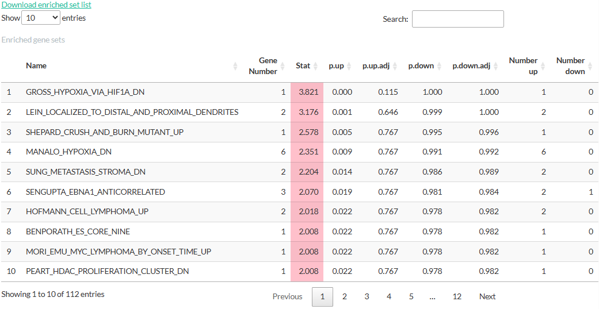
```

* **Name**: Name of the gene set
* **Gene Number**: Number of genes in the gene set that are also present in the result from Differential Expression analysis.
* **Stat**: Enrichment score.
* **p.up, p.up.adj, p.down, p.down.adj**: (adjusted) p-values estimated by the enrichment analysis.
* **Number up**: Number of genes with logFC > 0
* **Number down**: Number of genes with logFC < 0

(Pathway enrichment for Time series clustering)
```{r}
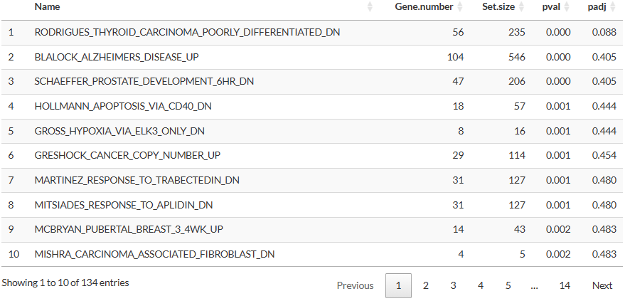
```

* **Gene.number**: Number of genes in the gene set that are also present in the selected cluster.
* **Set.size**: Number of genes in the gene set in the selected database.
* **pval, padj**: p-values estimated by the Fisher's exact test.

(Phospho-signature enrichment for Differential Expression analysis)
```{r}
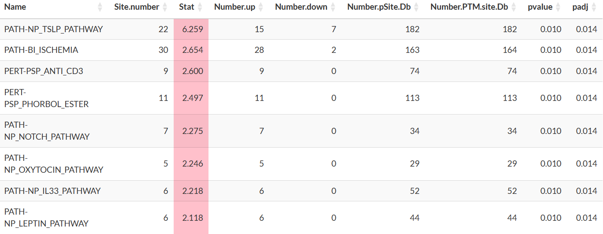
```

* **Name**: Name of the PTM signature set. Users should consult the PTMsigDB website (https://proteomics.broadapps.org/ptmsigdb/) for more descriptions of the names of these sets.
* **Site.number**: Number of phosphosites in the signature set that are also in the result from Differential Expression analysis.
* **Number.up**: Number of phosphosites with logFC > 0 **and** are registered as up-regulated in the signature set.
* **Number.down**: Number of phosphosites with logFC < 0 **and** are  registered as down-regulated in the signature set.
* **Number.pSite.Db**: Number of phosphosites belong to the signature set in the selected database.
* **Number.PTM.site.Db**: Number of PTM sites belong to the signature set in the selected database.
* **pvalue, padj**: p-value estimated by PTM-SEA.

(Phospho-signature enrichment for Time series clustering)
```{r}
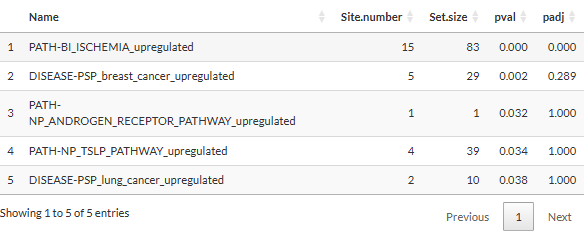
```

* **Name**: the appendix "_upregulated" or "_downregulated" indicates whether the phosphosites in the set are upregulated or downregulated according to the database.
* **Set.size**: Number of phosphosites belong to the signature set in the selected database.

Clicking on a set will open a table showing the details of genes/phosphopeptides in the set. We would like to notice that for pathway enrichment, a gene with more than one detected phosphosite would appear in several rows of this table, each corresponding to a phosphosite. Nevertheless, the analysis would only consider each gene once regardless of its number of phosphosite, thereby limiting the bias towards genes with several sites. For phospho-signature enrichment, the table has an additional column "PubMedID" (not shown in the figure below), which contains the PubMed identification or hyperlink of the source of the interaction. Multiple sources for a phosphosite are separated by semicolons. 
```{r}
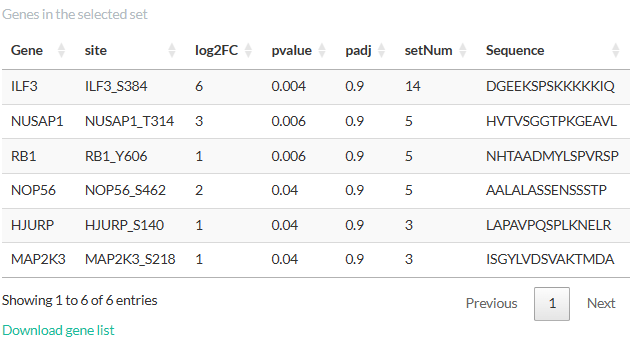
```

Clicking on a gene/phosphosite in this table will highlight the sets containing it:
```{r}
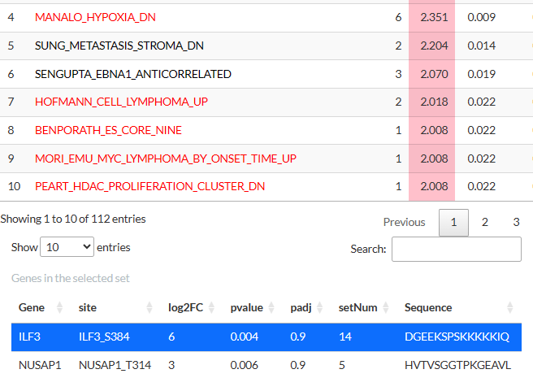
```

The tables above can be downloaded as tsv files. Clicking on a gene/phosphosite will also show its expression level either as a boxplot (differential expression analysis) or a scatterplot (time-series clustering).
```{r}
knitr::include_graphics("images/Q_enrich_result4.PNG")
knitr::include_graphics("images/Q_enrich_result5.PNG")
```

# Kinase activity inference

This tab performs kinase activity inference based on phosphopeptides that are differentially expressed or in a cluster. Similar to enrichment analysis, users would first need to perform either a differential expression analysis or time-series clustering and select a cluster of interest. By combining prior knowledge about known kinase-phosphosite interactions and the data, the tab can infer the activity of the kinases responsible for the phosphopeptides being considered. The activity is estimated by an activity score computed with the package **decoupleR** (Badia-I-Mompel et al., 2022) following the authors' tutorial on Kinase and Transcription Factor activity estimation. For time-series clustering, users can also estimate how likely the kinases are associated with phosphopeptides in the selected cluster.

A network of kinase-phosphosite interactions is constructed using the package **OmnipathR** (Türei et al., 2021). Users can choose to construct this network with prior knowledge from either Homo sapiens (taxonomy ID = 9606) or Mus musculus (taxonomy ID = 10090) by choosing the organism in **Select reference species**.

Users need to first select whether to perform the inference on result from either differential expression analysis or time-series clustering. This selection affects what type of analysis can be done, as is shown in the next two subsections.

## Differential expression
When selecting differential expression, the list of phosphopeptides from the differential expression analysis are used for kinase activity inference. The options to perform the inference from differential expression analysis result are shown below:
```{r,out.width="300px"}
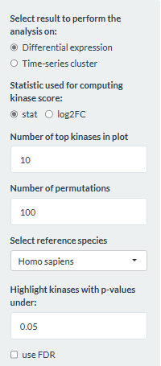
```

* **Statistic used for computing the kinase score**: Whether to compute the kinase score based of the t-statistic or logFC from the differential expression analysis.
* **Number of top kinases in plot**: How many kinases in each direction to display in the plot.
* **Number of permutations**: How many permutations should be done for calculating the null distribution.
* **Highlight kinases with p-values under**: Kinases whose p-values are below this threshold will be highlighted.
* **use FDR**: Whether the FDR should be used.

The output is a table showing the kinases, the activity score, and (adjusted) p-values. Positive scores are highlighted pink while negative ones are highlighted blue. For kinases with the most positive or negative activity score (default 10), their scores are also plotted in a horizontal barplot. Kinases whose p-values under the threshold are colored red.
```{r}
knitr::include_graphics("images/Q_kinase_result1.PNG")
```

**Interpreting the result**: The kinase activity is computed from comparing two conditions, hence it is important to take into account the conditions when interpreting the result. A positive score means that the kinase is more active in the selected condition compared to the reference one, while a negative score means that the kinase is more active in the reference condition.

Selecting a kinase will open a table showing the phosphosites targeted by the kinase. The information shown in the table is from the differential expression analysis: log2FC, t-statistic, peptide sequence, and (adjusted) p-values. We would like to notice that these p-values are from the differential expression analysis and should not be confused with those derived from the kinase activity inference. 
```{r}
knitr::include_graphics("images/Q_kinase_result2.PNG")
```

## Time-series clustering

When selecting time-series clustering, the list of phosphopeptides in the selected cluster (in the **Time series clustering** tab) is used to either infer the kinase activity score or how likely the kinases are associated with the cluster. These analyses will be explained in more details in the following 2 subsections.

### Estimating kinase activity score
For this part, users would need to define the number of permutations for calculating the null distribution.
```{r, out.width="300px"}
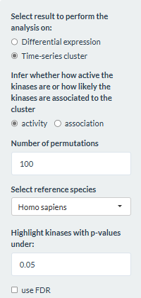
```

Then the option to perform clustering specified in the **Time series clustering** tab affects the analysis being done in this part. If the option **expression** was chosen, the fold-change in expression levels for consecutive time points would be used for the inference. Thus, the result would reflect how the kinase activity change over time. Below is an example of the result when performing the inference with 4 time points:
```{r}

```

* The table shows the kinases along with its activity score and (adjusted) p-values. The timepoint column shows which two time points were considered when estimating the score. Activity scores are labeled pink if they are positive and blue if negative.
* The kinase activity scores are plotted in a heatmap and those whose p-values below the threshold are highlighted by asterisk.

Clicking on a kinase will open a table showing the phosphosites targeted by the kinase:
```{r}
knitr::include_graphics("images/Q_kinase_result4.PNG")
```

If the **logFC** or **two-condition expression** option was chosen for time-series clustering, the fold-change in expression levels between the two treatments would be used for the inference. Thus, the result would reflect how the kinase activity differ between two treatments at each time point. The layout of the result is similar to that of the above-mentioned **expression** option:
```{r}
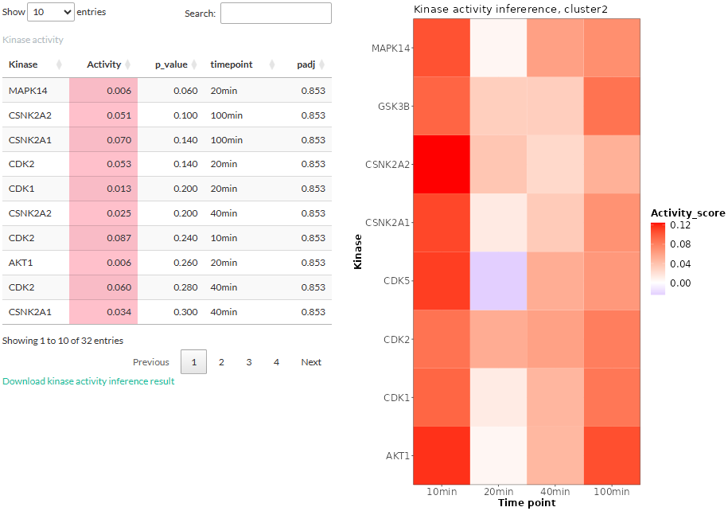
```

If no kinase was found (wrong reference species or no overlap with prior knowledge), users will be informed of the error:
```{r}
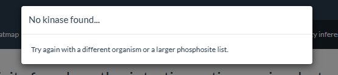
```

### Estimating kinase association
In addition to kinase activity, users can choose to determine whether the kinases are associated with the selected cluster, using either the Fisher's exact test or the Fast Gene Set Enrichment Analysis algorithm (FGSEA). In FGSEA, the probability of each site to be in the cluster is used to rank the sites. Performing FGSEA is done by the decoupleR package (Badia-I-Mompel et al., 2022) and requires users to set the number of permutations for calculating the null distribution. Both methods use the kinase-phosphosite interaction network as their reference. Unlike the above part on estimating kinase activity, the choice of method for time series clustering in the **Time series clustering** tab does not affect the method in this part.
```{r, out.width="300px"}
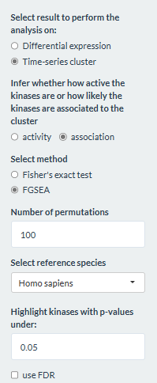
```

The result for the Fisher's exact test is displayed in a table. Kinases whose (adjusted) p-values higher than the p-value threshold are excluded.
```{r}
knitr::include_graphics("images/Q_kinase_result6.PNG")
```

* **number.pSite.in.cluster**: Number of phosphosites targeted by the kinase and are present in the cluster.
* **number.pSite.by.kinase**: Number of all phosphosites known to be targeted by the kinase, as derived from the above-mentioned kinase-phosphosite network.
* **p-value**: p-value from the test.
* **padj**: adjusted p-value (FDR).

The result for the FGSEA is also displayed in a table showing the enrichment score.
```{r,out.width="300px"}
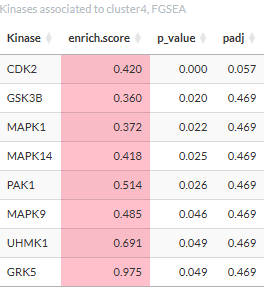
```

Clicking a kinase will open a table showing the phosphosites targeted by the kinase in the cluster.
```{r}
knitr::include_graphics("images/Q_kinase_result7.PNG")
```

# Log Info

This tab displays the information about the user inputs. All the settings selected by the user are displayed in a table and can be downloaded as a TSV file. The table contains the following columns:

* **name**: name of the input (usually the widget ID used in the shiny app script).
* **value**: the value associated with the name. This is the actual user input.
* **panel**: the tab panel in the shiny app to which this value belongs.
* **description**: a short description about that particular setting.

```{r}
knitr::include_graphics("images/log_info.PNG")
```


# References
Badia-I-Mompel, P., Santiago, J. V., Braunger, J., Geiß, C., Dimitrov, D., Müller‐Dott, S., Tauš, P., Dugourd, A., Holland, C. H., Flores, R. O. R., & Sáez-Rodríguez, J. (2022). decoupleR: ensemble of computational methods to infer biological activities from omics data. Bioinformatics Advances, 2(1). https://doi.org/10.1093/bioadv/vbac016

Kim, SY., Volsky, D.J. PAGE: Parametric Analysis of Gene Set Enrichment. BMC Bioinformatics 6, 144 (2005). https://doi.org/10.1186/1471-2105-6-144

Krug, K., Mertins, P., Zhang, B., Hornbeck, P., Raju, R., Ahmad, R., Szucs, M. J., Mundt, F., Forestier, D., Jané‐Valbuena, J., Keshishian, H., Gillette, M. A., Tamayo, P., Mesirov, J. P., Jaffe, J. D., Carr, S. A., & Mani, D. R. (2019). A curated resource for phosphosite-specific signature analysis. Molecular & Cellular Proteomics, 18(3), 576–593. https://doi.org/10.1074/mcp.tir118.000943

Liberzon, A., Birger, C., Thorvaldsdóttir, H., Ghandi, M., Mesirov, J. P., & Tamayo, P. (2015). The Molecular Signatures Database (MSigDB) hallmark gene set collection. Cell systems, 1(6), 417–425. https://doi.org/10.1016/j.cels.2015.12.004

Liberzon, A., Subramanian, A., Pinchback, R. M., Thorvaldsdóttir, H., Tamayo, P., & Mesirov, J. P. (2011). Molecular signatures database (MSigDB) 3.0. Bioinformatics, 27(12), 1739–1740. https://doi.org/10.1093/bioinformatics/btr260

Subramanian, A., Tamayo, P., Mootha, V. K., Mukherjee, S., Ebert, B. L., Gillette, M. A., Paulovich, A. G., Pomeroy, S. L., Golub, T. R., Lander, E. S., & Mesirov, J. P. (2005). Gene set enrichment analysis: A knowledge-based approach for interpreting genome-wide expression profiles. Proceedings of the National Academy of Sciences of the United States of America, 102(43), 15545–15550. https://doi.org/10.1073/pnas.0506580102 

Türei, D., Valdeolivas, A., Gul, L., Palacio-Escat, N., Klein, M., Ivanova, O., Ölbei, M., Gábor, A., Theis, F. J., Módos, D., Korcsmáros, T., & Sáez-Rodríguez, J. (2021). Integrated intra‐ and intercellular signaling knowledge for multicellular omics analysis. Molecular Systems Biology, 17(3). https://doi.org/10.15252/msb.20209923
           